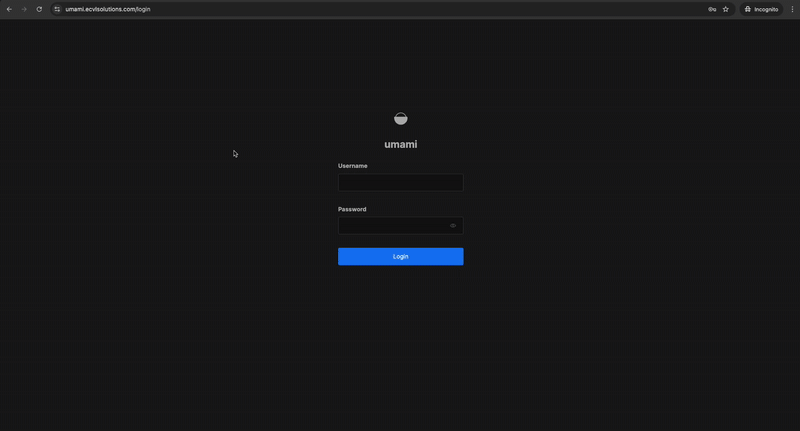
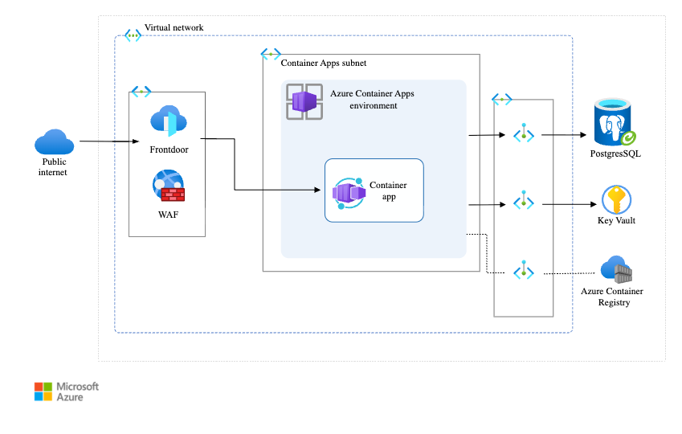

# Web Analytics Platform - Azure Container Apps Demo

A production-grade web analytics platform built on Azure Container Apps with Terraform infrastructure and GitHub Actions CI/CD.

## Overview

Privacy-focused web analytics alternative to Google Analytics with real-time tracking, multi-website support, and advanced reporting.



## Architecture



### Key Components

- **Azure Front Door**: Global CDN and load balancer with built-in DDoS protection and WAF
- **Azure Container Apps**: Serverless container platform hosting the web analytics application
- **Azure Container Registry (ACR)**: Private container registry for storing application images
- **PostgreSQL Flexible Server**: Managed database service with high availability
- **Azure Virtual Network**: Network isolation and security with private subnets
- **Network Security Groups**: Firewall rules for controlling network traffic
- **Managed Identity**: Secure authentication for container apps to access Azure resources
- **Log Analytics**: Centralized logging and monitoring


### Project Structure

```
aca-web-analytics-gha-demo/
├── .github/workflows/     # CI/CD pipelines
├── src/                   # Next.js application
├── terraform/            # Infrastructure as Code
│   ├── modules/          # Reusable Terraform modules
│   └── bootstrap/        # Initial infrastructure setup
├── db/                   # Database migrations
├── scripts/              # Build and deployment utilities
└── docs/                 # Documentation and images
```

### Platform Integration

#### Infrastructure Provisioning
Terraform pipelines for automated Azure resource deployment with modular architecture and state management.

#### Security Pipelines
Code quality checks, dependency scanning, and security validation through automated CI/CD workflows.

#### Build Pipeline
GitHub Actions workflows for container builds, testing, and deployment automation with multi-stage processes.

#### DNS Management
Azure DNS configuration with custom domain setup, SSL certificate management, and traffic routing.

#### Monitoring
Azure Monitor integration, Log Analytics workspace, and application performance insights with alerting.

## Quick Start

### Prerequisites
- Docker and Docker Compose

### Local Development

1. **Clone and setup**
   ```bash
   git clone <repository-url>
   cd aca-web-analytics-gha-demo
   cp .env.example .env
   ```

2. **Start local environment**
   ```bash
   docker-compose up
   ```

### Deployment

1. **Deploy infrastructure**
   ```bash
   cd terraform
   terraform init
   terraform plan
   terraform apply
   ```

2. **Application deploys automatically** via GitHub Actions on push to main

## Project Structure

```
.
├── .github/workflows/    # CI/CD pipelines
├── src/                 # Next.js application
├── terraform/           # Infrastructure as Code
├── db/                  # Database migrations
└── scripts/            # Build utilities
```

## License

MIT License
